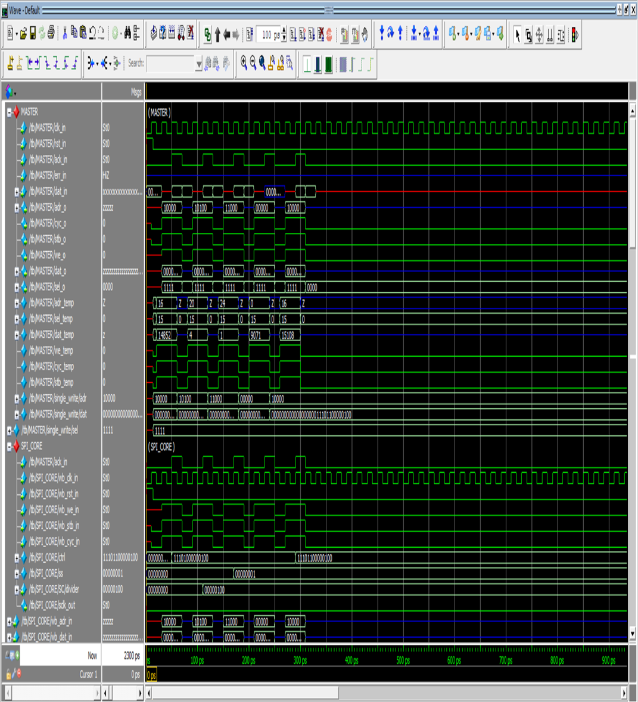

# SPI DESIGN USING VERILOG

## SPI Interface:
* The Serial Peripheral Interface (SPI) is a synchronous serial communication interface commonly used for short-distance communication between microcontrollers, sensors, and other peripheral devices.
* It allows for the exchange of data between a master device and one or more slave devices over a short-distance bus.  
 

## SPI Transfer Formats:
* SPI supports different transfer formats, which determine the timing and order of data bits transferred between the master and slave devices. 
* In each mode, the master and slave devices must be configured to use the same clock polarity (CPOL) and clock phase (CPHA) settings for successful communication. The choice of mode depends on the specific requirements of the devices connected to the SPI bus.
 

## SPI Master Interface:
* The SPI (Serial Peripheral Interface) master interface is a component or device that initiates and controls the communication on an SPI bus. 
* It takes on the role of the bus controller and is responsible for coordinating the data transfer with one or more slave devices. 
* The master generates the clock signal, which synchronises data transmission between devices. 
* The clock signal determines the timing of data bits on the bus.
 

## SPI Master Core features:
* The SPI (Serial Peripheral Interface) master core is a specialized IP (Intellectual Property) block or module that provides the functionality of an SPI master interface in a digital system. 
 

## Architecture of SPI CORE:
* The architecture of an SPI master core refers to the internal structure and organization of the IP (Intellectual Property) block responsible for implementing the SPI master functionality in a digital system.
* The SPI master core consists of several sub-blocks that work together to enable SPI communication with slave devices. 
 

## Wishbone master:
* The Wishbone Master functionality in an SPI Master Core refers to its ability to act as the bus master in a Wishbone-based system while supporting the Serial Peripheral Interface (SPI) protocol.
 

## Key Features of Wishbone Master Interface:
* The Wishbone master interface is a key component in a digital system that follows the Wishbone bus architecture. 
* It enables a master device to communicate and interact with other devices on the bus. 
 

## SPI Master Core:
* SPI Master in an SPI Master Core enables the core to act as the controlling entity of the SPI bus, facilitating communication with slave devices through data transmission and reception, clock rate configuration, error handling, and status reporting.
* The functionality of an SPI Master in an SPI Master Core refers to its capabilities and operations in controlling and communicating with SPI slave devices. 
 

## Key features of SPI Master Core:
* The SPI Master interface incorporates several key features that enable communication and control between the SPI master and slave devices. 
* SPI Master Core consists of two design blocks: Clock generator and Shift register.
 

## SPI Serial Slave:
* The SPI Serial Slave block in an SPI Master core refers to the component responsible for managing and communicating with the slave devices connected to the SPI bus. 
* It is an integral part of the SPI Master core that handles the control and data transfer operations with individual slave devices.
 

## Results:

   
  SPI Clock generator (spi_clgen) waveforms

 

   
  SPI Shift generator (spi_shift_gen) waveforms

 

   
  SPI Top Module (tx_neg=0, rx_neg=1, LSB=1, char_len=4) waveforms

